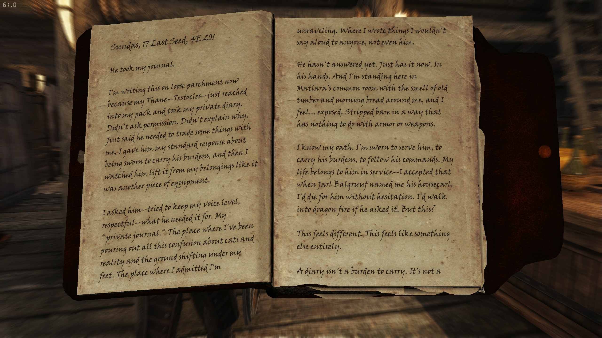

# SkyrimNet Physical Diaries

A companion mod for [SkyrimNet](https://github.com/MinLL/SkyrimNet-GamePlugin) that turns the AI-generated diary entries written by NPCs into actual books you can find and read in the world.

<p align="center">
  
</p>

---

## Features

### Physical Diary Books
Each NPC that writes diary entries will have a physical diary book in their inventory. The entries are formatted by in-game date and use a handwriting font.

### Multi-Volume Support
When a diary fills up, it seals itself and a fresh volume begins. Sealed volumes stay in the NPC's inventory alongside newer ones, giving you a complete history to read. The number of entries per volume can be configured in the MCM.

### Theft & Return System
Stealing an NPC's diary has consequences. The NPC will be aware their diary is missing when writing a new entry. Returning the diary before their next entry clears the record entirely — they'll never know it was taken. Taking a followers diary by trading items will trigger a response making the NPC aware that you took it.

### Automatic Updates
When an NPC writes a new entry, their physical diary updates to include it. If they fill the current volume, a new one is created automatically. This happens in the background without any player action needed.

---

## MCM Settings

Found under **SkyrimNet Physical Diaries** in the Mod Configuration Menu.

**Settings**
- **Entries Per Volume** — How many diary entries fit in one book before a new volume begins (default: 10, range: 1–50)
- **Font Sizes** — Separate sliders for title, date, body text, and small text in the diary books

**Maintenance**
- **Reset All Diaries** — Removes all physical diary books from NPCs and clears all tracking. Your SkyrimNet diary entries are untouched; books will regenerate automatically on next load.
- **Debug Logging** — Toggle verbose logging for troubleshooting.

---

## Requirements

- [SkyrimNet](https://github.com/MinLL/SkyrimNet-GamePlugin)
- [Dynamic Persistent Forms](https://www.nexusmods.com/skyrimspecialedition/mods/116001)
- [SkyUI](https://www.nexusmods.com/skyrimspecialedition/mods/12604) (for MCM)
- [SKSE](https://skse.silverlock.org/)
- [Address Library](https://www.nexusmods.com/skyrimspecialedition/mods/32444) or [VR Address Library](https://www.nexusmods.com/skyrimspecialedition/mods/58101)
- [Native EditorID Fix](https://www.nexusmods.com/skyrimspecialedition/mods/85260)

---

## Installation

Install with a mod manager as normal. Load order: place after SkyrimNet and Dynamic Persistent Forms.

Currently in order to enable diary theft awareness you must add the following to your `diary_entry.prompt` underneath `## Instructions`:

```

    **IMPORTANT**: You notice that your diary has been stolen! Write about your reaction.

```

---

## Localization

The mod supports all 9 official Skyrim languages out of the box: English, French, German, Italian, Spanish, Polish, Russian, Traditional Chinese, and Japanese. Diary titles, dates, volume numbering, and MCM menus are all localized automatically based on your game language.

### Language Override

If your game language is set to English but you want diary books in another language, add a `Language` line to `SkyrimNetPhysicalDiaries.ini` under `[General]`:

```ini
[General]
Language = GERMAN
DebugLog = 0
```

This will load `Locales/GERMAN.ini` for diary formatting. The value must match the name of a locale file in the `Locales` folder.

### Adding a New Language

Community translators can add support for any language without recompiling the plugin. Two files are needed:

**1. Locale file** — `SKSE/Plugins/SkyrimNetPhysicalDiaries/Locales/{LANGUAGE}.ini`

This controls how diary book titles, dates, and volume numbers are formatted. Example:

```ini
; SKSE/Plugins/SkyrimNetPhysicalDiaries/Locales/PORTUGUESE.ini

[Format]
DateLong = {Day}, {d} {Month}, 4E {y}
DateShort = {d} {Month}, 4E {y}
DiaryTitle = Diário de {Name}
VolumeSuffix = , vol. {n}
EmptyVolumeText = Todas as entradas deste período foram removidas.

; Optional — omit these sections to use month/day names from the game's GMSTs.
; Only needed if your language doesn't have GMST overrides (unofficial languages).
[Months]
January = Estrela da Manhã
February = Aurora do Sol
; ... (all 12 months, keyed January through December)

[Days]
Sunday = Sundas
Monday = Morndas
; ... (all 7 days, keyed Sunday through Saturday)
```

Available placeholders:
- `{Day}` — day of the week (e.g. Sundas)
- `{d}` — day number (e.g. 17)
- `{Month}` — month name (e.g. Last Seed)
- `{y}` — year (e.g. 201)
- `{Name}` — NPC name (in DiaryTitle)
- `{n}` — volume number (in VolumeSuffix)
- `{cn}` — volume number as Chinese numeral (二, 三, etc.)

If a `[Months]` or `[Days]` section is omitted, the plugin reads month/day names from the game's GMST records automatically. This means officially supported languages and languages with GMST-overriding translation mods need only provide the `[Format]` section.

**2. MCM translation file** (optional) — `Interface/Translations/SkyrimNet Physical Diaries_{LANGUAGE}.txt`

This translates the in-game settings menu. The file must be **UTF-16 LE with BOM** encoding, with tab-separated key/value pairs. See the existing English file for the full list of keys.

---

## Notes

- Diary books appear in NPC inventories after SkyrimNet generates the NPC's first diary entry. NPCs without any diary entries will have no books. You must generate SkyrimNet's diary entries yourself.
- Player character diaries are supported and will appear in the player's inventory.
- If books are missing after installing on an existing save, use **Reset All Diaries** followed by saving and reloading.
