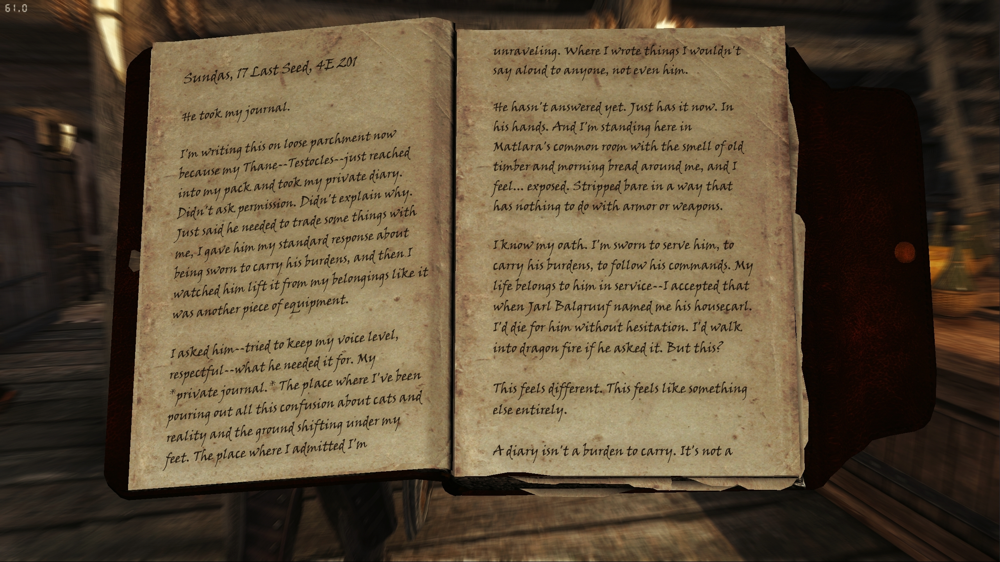

# SkyrimNet Physical Diaries

A companion mod for [SkyrimNet](https://github.com/MinLL/SkyrimNet-GamePlugin) that turns the AI-generated diary entries written by NPCs into actual books you can find and read in the world.

<p align="center">
  
</p>

## 📖 Features

### Physical Diary Books
Each NPC that writes diary entries will have a physical diary book in their inventory. The entries are formatted by in-game date and use a handwriting font.

### Multi-Volume Support
When a diary fills up, it seals itself and a fresh volume begins. Sealed volumes stay in the NPC's inventory alongside newer ones, giving you a complete history to read. The number of entries per volume can be configured in the MCM.

### Theft & Return System
Stealing an NPC's diary has consequences. The NPC will be aware their diary is missing when writing a new entry. Returning the diary before their next entry clears the record entirely — they'll never know it was taken. Taking a followers diary by trading items will trigger a response making the NPC aware that you took it.

### Automatic Updates
When an NPC writes a new entry, their physical diary updates to include it. If they fill the current volume, a new one is created automatically. This happens in the background without any player action needed.

### Writing in Your Own Journal
With writing installed, what you write goes in your journal ("{Name}'s Journal"), next to the diary SkyrimNet writes for you, which stays read-only (it stops growing once writing is installed; turn **Your Diary Books** on in the MCM to keep it going). Writing needs a quill and an inkwell (each writing session uses a little ink; with Description Framework installed, an inkwell's description shows how full it is). While reading your journal, press **F3** (configurable in the MCM) to write in it, right on the page. Press it again to save and go back to reading. Only the entries' text can be changed; the dates stay. Closing the book while writing asks whether to save your changes. To tear out an entry, put the cursor in it and press **F10** (configurable); you're asked first, and it can't be undone. Other mods' hotkeys (SkyrimNet's dashboard and capture keys, for example) can still fire while you type, so bind them to keys you don't type with, such as F-keys. With a quill but no ink you can write in your own blood: each entry you write in costs a tenth of your health, and the words stay dark red. To start a journal, read a Blank Journal (sold by general-goods merchants, or made at a tanning rack from 1 Leather and 2 Rolls of Paper); it becomes a journal in that book's look. A journal holds as many entries as a diary volume (**Entries Per Volume**); you can keep several and write in whichever you open. To write a new entry, bind the **New Entry Key** in the MCM (it's unbound by default) and press it, with a journal open or during play (it opens the journal you last wrote in). Your changes go back into SkyrimNet, so the diary entry and the memory made from it both change.

Optionally (MCM, off by default, since every entry is an LLM call), NPCs write diary entries on their own once a day: a few NPCs with an eventful day, and anyone you've asked in dialogue to "keep a diary" every day. NPCs with too little to write about write nothing, so it costs nothing. NPCs' diaries can only be read: their entries are their memories.

## 📝 MCM Settings

Found under **SkyrimNet Physical Diaries** in the Mod Configuration Menu.

 **Settings**
- **Your Diary Books** - Makes books of the diary SkyrimNet writes for you, as for NPCs (default: off with writing installed, on without). Off, your diary stops at its last entry; your journal isn't affected.
- **Entries Per Volume** - How many entries fit in one book: a diary starts a new volume, and a full journal of yours takes no new entry (default: 10, range: 1–50).
- **Font Sizes** - Separate sliders for title, date, body text, and small text in the diary books
- **Book Font** - Switch font faces for readability
- **Edit Your Journal Key** - Starts writing while you read your journal, and saves when pressed again (default: F3). Pick a key that doesn't type a character.
- **Tear Out Entry Key** - While writing, tears out the entry the cursor is in, after asking (default: F10).
- **New Entry Key** - Starts a new entry in the open journal, or during play in the journal you last wrote in (unbound by default). A new journal begins when you read a Blank Journal.
- **NPCs Write Diaries** - NPCs write diary entries on their own once a day (default: off). Each entry is one LLM call; NPCs with too little to write about cost nothing. Ask an NPC "Would you keep a diary?" to have them write every day.
- **Random Writers Per Day** - How many NPCs with an eventful day are picked to write, besides those you asked (default: 3).
- **Writing Hour** - When NPCs write (default: 22:00). Sleeping, waiting, fast travel or a carriage in the 4 hours before has them write first.
- **Favor Followers and Spouse** - Followers and your spouse are twice as likely to be picked (default: on).

**Maintenance**
- **Reset All Diaries** - Removes all physical diary books from NPCs and clears all tracking. Your SkyrimNet diary entries are untouched; diaries regenerate automatically on next load. Your journals are kept as they are.
- **Debug Logging** - Toggle verbose logging for troubleshooting.

## 📋 Requirements

- [SkyrimNet](https://github.com/MinLL/SkyrimNet-GamePlugin)
- [SkyUI](https://www.nexusmods.com/skyrimspecialedition/mods/12604) (for MCM)
- [SKSE](https://skse.silverlock.org/)
- [Address Library](https://www.nexusmods.com/skyrimspecialedition/mods/32444) or [VR Address Library](https://www.nexusmods.com/skyrimspecialedition/mods/58101)
- [powerofthree's Tweaks](https://www.nexusmods.com/skyrimspecialedition/mods/51073) **or** [powerofthree's Tweaks VR](https://www.nexusmods.com/skyrimspecialedition/mods/59510)
> [!NOTE]
> Dynamic Persistent Forms is no longer required as of version 2.0

## 🌐 Localization

The mod supports all 9 official Skyrim languages out of the box: English, French, German, Italian, Spanish, Polish, Russian, Traditional Chinese, and Japanese. Diary titles, dates, volume numbering, and MCM menus are all localized automatically based on your game language.

### Language Override

If your game language is set to English but you want diary books in another language, add a `Language` line to `SkyrimNetPhysicalDiaries.ini` under `[General]`:

```ini
[General]
Language = GERMAN
DebugLog = 0
```

This will load `Locales/GERMAN.ini` for diary formatting. The value must match the name of a locale file in the `Locales` folder. Ensure you have the proper fonts installed to support that language.

### Adding a New Language

Community translators can add support for any language without recompiling the plugin. Two files are needed:

**1. Locale file** - `SKSE/Plugins/SkyrimNetPhysicalDiaries/Locales/{LANGUAGE}.ini`

This controls how diary book titles, dates, and volume numbers are formatted. Example:

```ini
; SKSE/Plugins/SkyrimNetPhysicalDiaries/Locales/PORTUGUESE.ini

[Format]
DateLong = {Day}, {d} {Month}, 4E {y}
DateShort = {d} {Month}, 4E {y}
DiaryTitle = Diário de {Name}
VolumeSuffix = , vol. {n}
EmptyVolumeText = Todas as entradas deste período foram removidas.

[Months]
Morning Star = Estrela da Manhã
Sun's Dawn = Aurora do Sol
First Seed = Primeira Semente
Rain's Hand = Mão da Chuva
Second Seed = Segunda Semente
Midyear = Meio do Ano
Sun's Height = Altura do Sol
Last Seed = Última Semente
Hearthfire = Fogo da Lareira
Frostfall = Queda da Geada
Sun's Dusk = Crepúsculo do Sol
Evening Star = Estrela Vespertina

[Days]
Sundas = Sundas
Morndas = Morndas
Tirdas = Tirdas
Middas = Middas
Turdas = Turdas
Fredas = Fredas
Loredas = Loredas
```

Available placeholders:
- `{Day}` - day of the week (e.g. Sundas)
- `{d}` - day number (e.g. 17)
- `{Month}` - month name (e.g. Last Seed)
- `{y}` - year (e.g. 201)
- `{Name}` - NPC name (in DiaryTitle)
- `{n}` - volume number (in VolumeSuffix)
- `{cn}` - volume number as Chinese numeral (二, 三, etc.)
> [!NOTE]
> If these sections are omitted, the plugin falls back to reading month/day names from the game's GMST records, then to English. Note that some mods (e.g. Seasons of Skyrim) override GMST month names, so including `[Months]` and `[Days]` in your locale file is recommended.

**2. MCM translation file** (optional) - `Interface/Translations/SkyrimNet Physical Diaries_{LANGUAGE}.txt`

This translates the in-game settings menu. Use the English file as a template. If you would like to correct or contribute any translations feel free to submit a PR.

## 🗒️ Notes

- Diary books appear in NPC inventories after SkyrimNet generates the NPC's first diary entry. NPCs without any diary entries will have no books. You must generate SkyrimNet's diary entries yourself.
- Player character diaries are supported and will appear in the player's inventory.
- If books are missing after installing on an existing save, use **Reset All Diaries** followed by saving and reloading. Also ensure you have powerofthree's Tweaks or Native EditorID Fix installed so the mod can locate the templates.
- Generic NPCs that share a name (e.g. multiple "Whiterun Guard") will share a single, pooled diary. SkyrimNet groups memories by actor name, so same-named NPCs are treated as one identity. To give these NPCs distinct diaries, use a mod that assigns unique names such as **Real Names Extended** — with unique names, each NPC gets its own diary.

## 🔑 License

SkyrimNet Physical Diaries is released under the GNU General Public License v3.0 or later (GPL-3.0-or-later). See [LICENSE.md](LICENSE.md) for the full text.
